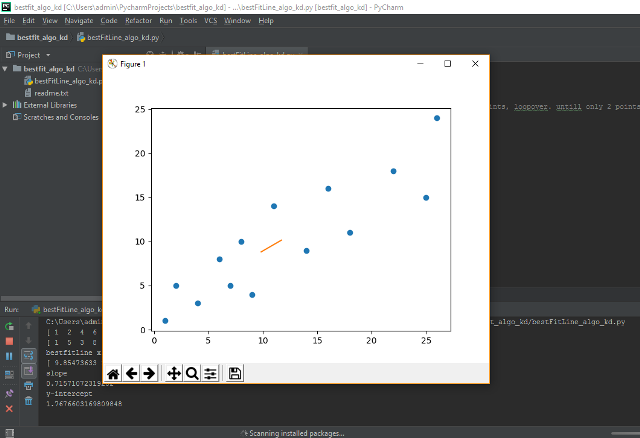

# bestFitLine-algo-kd
Finding best fit line for given datapoints with a different approach 

Find midpoints for all given consecutive data points, call method recursivly untill only two points are left.
Connect two points .ie our best fit line.

Close Approx. results when compared to other algorithm (gradient decent, mean mean method, least square method)

Which Algorithm calculates best "best fit line"?

Depends on which algorithm results are predicting results accurately.

Program: 
1. Sample 2-dimentional data
2. enter x train and y train
3. Plotted datapoints, to understand data points on plane and plotting best fit line.
5. Output : 2 points (bestfitline) ,Slope , y-intercept.

#
another best fit line algo, alternative 
Machine Learning algorithms
Regression lines
